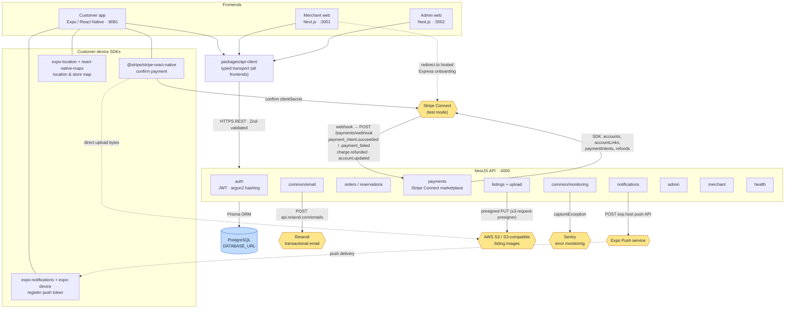
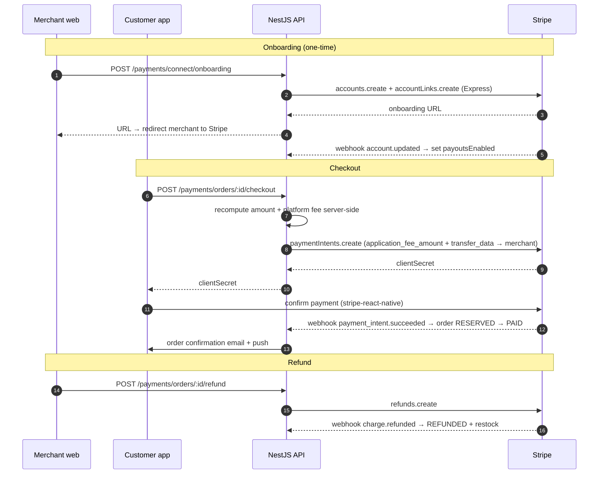

# RescueBite — Integrations Flowchart

Every external service the platform talks to, and how data flows between the apps,
the NestJS API, and third parties. Diagrams use [Mermaid](https://mermaid.js.org/)
(renders natively on GitHub).

## System & integrations overview

> **Legend** — 🟨 amber = third-party service · 🟦 blue = datastore.
> Solid arrows are direct API calls; dotted arrows are redirects / async delivery.

## Integration inventory

| Integration | Used by | Purpose | Env / config | Dev fallback when unset |
| --- | --- | --- | --- | --- |
| **PostgreSQL** (Prisma) | API (all modules) | Persistence | `DATABASE_URL` | — (required) |
| **Stripe Connect** (`stripe`) | API `payments`; customer app `@stripe/stripe-react-native` | Marketplace payments: Express onboarding, PaymentIntents w/ `application_fee_amount` + `transfer_data`, refunds, webhooks | `STRIPE_SECRET_KEY`, `STRIPE_PUBLISHABLE_KEY`, `STRIPE_WEBHOOK_SECRET`, `PLATFORM_FEE_BPS` | Payment endpoints return **503**; rest of API still boots |
| **Resend** | API `common/email` | Transactional email (verify email, password reset, order confirmation, refund notice, store-approval result) | `RESEND_API_KEY`, `EMAIL_FROM` | Email is **logged to console** instead of sent |
| **Expo Push** | API `notifications`; customer app `expo-notifications`/`expo-device` | Push notifications to registered device tokens; prunes dead tokens | `EXPO_ACCESS_TOKEN` | Push payload is **logged** instead of sent |
| **AWS S3** (`@aws-sdk/client-s3`) | API `listings/upload` | Presigned PUT URLs for listing images; client uploads bytes directly | `S3_BUCKET`, `S3_REGION`, `S3_ENDPOINT`, `S3_ACCESS_KEY_ID`, `S3_SECRET_ACCESS_KEY`, `S3_PUBLIC_URL` | Returns a **stub upload ticket** |
| **Sentry** (`@sentry/node`) | API `common/monitoring` | Captures unexpected 5xx errors (via `HttpExceptionFilter`) | `SENTRY_DSN` | Monitoring **disabled** (no phone-home) |
| **Expo Location / Maps** | Customer app | Device geolocation + store map | client-side (Expo) | — |

## Payment flow (Stripe Connect marketplace)

